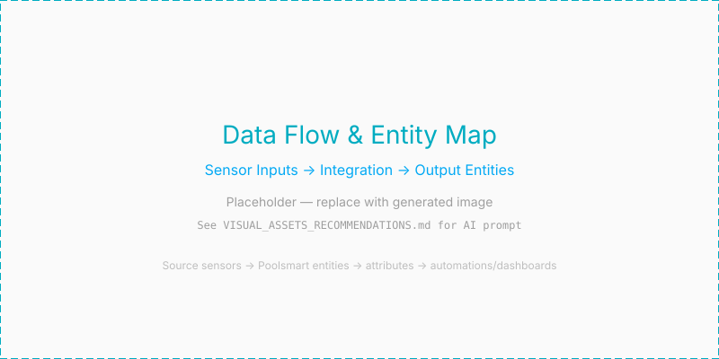

> [? Back to README](../README.md) | [Getting Started](GETTING_STARTED.MD) | [Architecture](architecture.md) | [Configuration](configuration.md) | [Troubleshooting](troubleshooting.md)

---

# Entity IDs

This document explains how PoolSmart names its entities and why. For mapping
your source sensors to integration fields, see [sensors.md](sensors.md). For the
entity fallback table, see [architecture.md](architecture.md).

---

## Fixed IDs, Translated Names

Entity ids are fixed in code rather than derived from the displayed name, so they
read the same on a Dutch and an English install: `sensor.pool_status`,
`binary_sensor.pool_heating`, `select.pool_mode`, where the prefix is the slug of
the name you gave the integration.

Displayed names are still translated. You see "Klaar om" in the interface while
the id stays `sensor.pool_ready_at` — names are for reading, ids are for
referring to. Home Assistant normally derives one from the other, which produced
`sensor.pool_klaar_om` on a Dutch system: fine for one person, useless in a
dashboard or automation anyone else might paste in.

### Upgrading from Before 0.7.0

Installed before 0.7.0? The ids are renamed once on startup and every rename is
written to the log.

---

## Source Sensors Are Not Copied

The water and outdoor temperatures ride along as attributes on
`sensor.<name>_status` so a card can show them next to the reason, but a graph
should point at your own sensor.

---

## See Also

- [sensors.md](sensors.md) — How to map your sensors to the right fields
- [architecture.md](architecture.md) — Entity fallback table and operating envelope
- [configuration.md](configuration.md) — How to change entity assignments after setup
