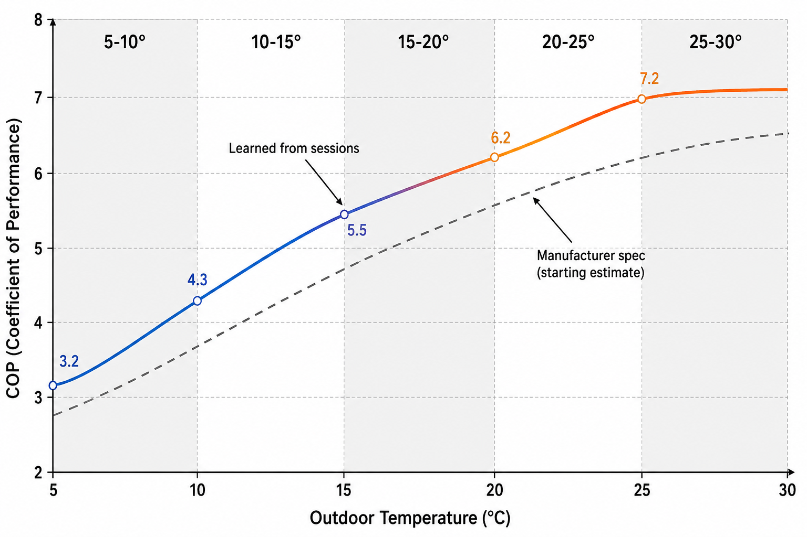

> [← Back to README](../README.md) | [Getting Started](GETTING_STARTED.MD) | [Architecture](ARCHITECTURE.MD) | [Configuration](CONFIGURATION.MD) | [Troubleshooting](TROUBLESHOOTING.MD)

---

# Self-Learning Heating & Efficiency Model

This document covers how PoolSmart learns your pool's actual thermal behavior
over time. For how these learned values feed into heating schedules, see
[PLANNING.MD](PLANNING.MD). For the decision ladder that produces the sessions
being learned from, see [ARCHITECTURE.MD](ARCHITECTURE.MD).

---

## What Is Learned?

After each heating session, PoolSmart updates three core parameters:

1. **Heating rate (°C/h):** How fast your pool water warms up per hour of
   active heating.
2. **Heat loss rate (°C/h):** How quickly your pool loses heat to ambient air
   and evaporation.
3. **COP curve (per 5 °C air band):** Thermal efficiency measured per 5 °C
   outdoor temperature bracket (e.g., 10–15 °C, 15–20 °C, 20–25 °C). Because
   non-inverter heat pumps operate at fixed output, one COP value per temperature
   band is sufficient.

  

---

## The Three Rules That Keep the Model Honest

To prevent corrupted sensors, hardware glitches, or open pool covers from
ruining your baseline, PoolSmart enforces three strict validation rules:

> **Rule 1: Clean sessions only**  
> Interrupted sessions, safety trips, manual cut-offs, or sessions under the
> minimum measurement duration are logged and flagged, but **never used for
> learning**.

> **Rule 2: Weighted moving average (exponential smoothing)**  
> Every valid update is capped at a small fraction of the existing value. A
> single unusual session (e.g., an exceptionally windy day) will only slightly
> nudge the model rather than overwrite it.

> **Rule 3: Physical outlier rejection**  
> Data is rejected based on physical boundaries rather than purely statistical
> deviations. For example:
> - A measured COP exceeding the heat pump's physical bounds.
> - Water failing to warm up while the pump was reported active.

---

## Diagnostics & Session Logging

Rejected sessions are not deleted; they remain stored in the log history along
with the explicit reason for rejection.

If the planning target dates stop updating or seem inaccurate, checking the
**Learning** tab in the `/poolsmart` panel for rejected sessions is the first
step in troubleshooting.

---

## See Also

- [PLANNING.MD](PLANNING.MD) — How the learned COP curve feeds directly into
  price optimization and heat scheduling.
- [ARCHITECTURE.MD](ARCHITECTURE.MD) — Entity fallback behavior when heat pump
  inlet/outlet sensors are missing.
- [SENSORS.MD](SENSORS.MD) — How to calibrate the probes that feed the learning
  model.
- [HEATING.MD](HEATING.MD) — Heating sources and how pool construction affects heat loss.
