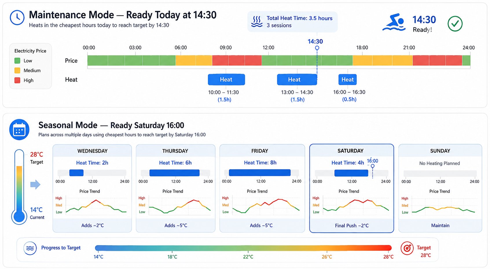
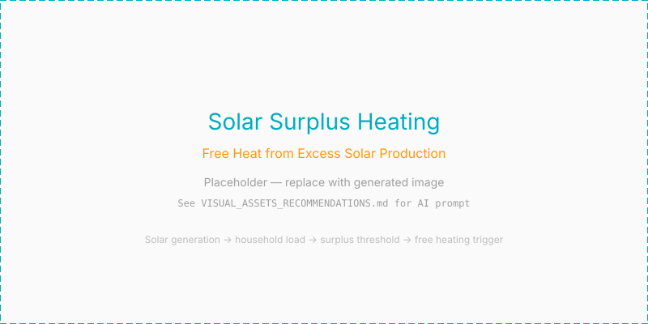

> [← Back to README](../README.md) | [Getting Started](GETTING_STARTED.MD) | [Architecture](ARCHITECTURE.MD) | [Configuration](CONFIGURATION.MD) | [Troubleshooting](TROUBLESHOOTING.MD)

---

# Heating Planning & Price Optimization

This document covers how PoolSmart plans heating sessions to minimize cost while
reaching your target temperature on time. For the decision ladder that executes
these plans, see [ARCHITECTURE.MD](ARCHITECTURE.MD). For the self-learning model
that supplies the COP curve and heat loss figures the planner relies on, see
[LEARNING.MD](LEARNING.MD).

---

## Maintenance vs. Seasonal Mode

  

Depending on the difference between the target temperature and current water
temperature, the optimizer operates in one of two distinct modes:

| Mode | Trigger / Condition | How It Works | Expected Result |
| :--- | :--- | :--- | :--- |
| **Maintenance** | Compensating a day's heat loss (ΔT ≤ ~2 °C). | The optimizer picks the cheapest intervals before the next swimming time. | Reports a **target time** (e.g., *"Ready today at 14:30"*). |
| **Seasonal** | Bringing a cold pool up to temperature (ΔT > 2 °C). | Requires long continuous runs (10–15+ hours). Projects budget across multiple days. | Reports a **target date** (e.g., *"Ready on Saturday 16:00"*). |

> **Thermal equilibrium warning:** If heat loss equals or exceeds the maximum
> thermal output of your heat pump (e.g., during cold nights without a cover),
> Seasonal mode will explicitly notify you that the temperature cannot be
> reached instead of outputting an impossible target date.

---

## Dynamic Electricity Price Integrations

PoolSmart parses hourly price attributes automatically from popular Home
Assistant integrations (such as Nordpool, EnergyZero, Frank Energie, ENTSO-E,
or custom template sensors).

### Price Optimization Logic

1. **Window selection:** The optimizer maps the required heat-up duration
   against upcoming price slots before the scheduled swim time.
2. **COP-weighted cost:** It adjusts the effective cost per thermal kWh using the
   self-learning COP curve. A slightly higher electricity price at 22 °C air
   temperature might actually be cheaper per thermal kWh than a lower price at
   12 °C air due to higher heat pump COP.

3. **Fallback mode:** If no valid price entity or forecast attribute is found,
   PoolSmart falls back to **heating on demand** whenever temperature drops
   below hysteresis.

---

## Solar Surplus

Above a threshold of surplus solar power, heating is treated as free and the
price limit is ignored. The threshold is not a fixed number, because the right
value is a property of the installation: it has to be at least what the heat pump
and circulation pump draw together. For a 3 kW heat pump taking 580 W with a
100 W pump that is 680 W, plus a margin so a passing cloud does not start and
stop a session.

Leave the setting empty and it is calculated. Set it too low and you consume more
than you generate; set it too high and you decline free heat on moderately sunny
afternoons.

`sensor.<name>_solar_surplus` shows the current figure with the threshold, the
shortfall and the equipment draw as attributes, so "is this enough" has a visible
answer.

---

## See Also

- [ARCHITECTURE.MD](ARCHITECTURE.MD) — How the heat pump's operating envelope
  gates heating sessions (Branch 6 of the decision ladder).
- [LEARNING.MD](LEARNING.MD) — How the COP curve per temperature band and
  thermal loss rates are learned over time and fed into the planner.
- [SENSORS.MD](SENSORS.MD) — How to map your price sensor and solar sensors.
- [HEATING.MD](HEATING.MD) — Heating sources and how solar collectors are handled.
