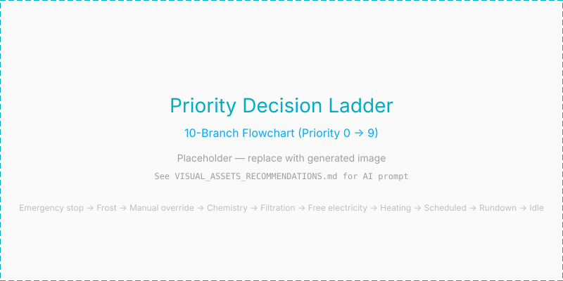

> [Home](index.md) | [Getting Started](getting_started.md) | [Architecture](architecture.md) | [Configuration](configuration.md) | [Troubleshooting](troubleshooting.md)

---

# Architecture & Decision Core

This document covers how PoolSmart evaluates decisions, calculates daily
filtration, and manages component failure. For the heating planner that consumes
these decisions, see [Planning](planning.md). For the self-learning model
that improves predictions over time, see [Learning](learning.md).

---

## The Priority Decision Ladder

<p align="center">
  
</p>

Every 30 seconds, PoolSmart evaluates the current state of your pool against a
strict priority ladder. The evaluation walks from the top down; **the first
condition that matches wins**, and all lower branches are ignored.

| Priority | Branch / Condition | Ignores Night Quiet? | Description |
| :---: | :--- | :---: | :--- |
| **0** | Emergency stop | Yes | Global manual kill-switch or safety interlock triggered. |
| **1** | Frost protection | Yes | Temp drops below safe threshold; forces circulation. |
| **2** | Manual override | Yes | User manually forced the pump ON/OFF in Home Assistant. |
| **3** | Chemistry cycle | Yes | Scheduled chemical dosing or shock treatment. |
| **4** | Free electricity | Yes | Triggered when electricity price is negative (< 0). |
| **5** | Heating session | **No** | Dynamic heating session active based on COP and prices. |
| **6** | Filtration deadline | Yes | Ensures minimum turnover is met before the day ends. |
| **7** | Scheduled filtration | **No** | Regular background filtration block. |
| **8** | Pump rundown | **No** | Cool-down period after heating before turning pump off. |
| **9** | Idle | — | No action required; pump and heating remain off. |

Free electricity and Heating sit above Filtration deadline: a free or
already-planned heating opportunity gets first refusal, and the deadline's
"circulate regardless of price" override only kicks in once neither applies —
so a critical deadline still wins exactly as before whenever heating doesn't.

> **Safety interlock:** Branches 0–3 and 6 (Emergency stop, Frost protection,
> Manual, Chemistry, Filtration deadline) may always break an ordinary hold.
> They are **not** active when the pool's mode is **Off**: off means off,
> including frost protection. Use **Stand-by** instead of Off to keep frost
> protection active on a pool that is unattended but still filled.

### Heat Pump Operating Envelope

In front of branches **4 (Free Electricity)** and **5 (Heating)** sits an
operating envelope gate. If the outdoor air temperature drops below the heat
pump's minimum operating limit (e.g., < 11 °C), heating is disabled. In this
state, Frost Protection (Branch 1) will only trigger simple **water circulation**,
which is sufficient to prevent freezing.

### Demand/Power Limiter

A second, independent gate sits alongside the operating envelope in front of
branches **4** and **5**: with a house power sensor and a cap configured
(`core.ladder._demand_allows_heating`), heating is refused whenever current
house draw — plus the pool's own equipment, if not already running — would
exceed the cap. It is a ceiling, the mirror of the solar-surplus floor: solar
surplus allows heating regardless of price; the demand limiter forbids it
regardless of anything else, including Boost, since it exists to protect a
hard electrical or contract limit rather than to optimise cost. Once the
heat pump is already running, the meter's own reading is used as-is, which
is what lets the same gate pause an already-active session if the rest of
the house's draw climbs over the cap mid-session, not just block a new one
from starting.

---

## Filtration Calculation

Filtration runtime is calculated dynamically based on physical metrics rather
than hardcoded timers:

```
Daily Runtime (hours) = Pool Volume (L) × Turnover Factor / Effective Pump Flow (L/h)
Block Duration        = Daily Runtime / Number of Scheduled Blocks
```

### Key Filtration Behaviors

- **Derating factor:** If pump flow is unmeasured (taken from a spec sheet), it is
  automatically derated by 25–40% to account for filter resistance.
- **Self-correcting blocks:** If a flow meter is installed, block durations
  automatically adjust as filter pressure changes over time.
- **Heating session credit:** Any time spent running the pump during heating
  sessions counts directly towards your daily filtration quota, preventing
  redundant pump runtime.

---

## Entity Mapping & Fallbacks

All sensors and switches can be updated anytime under **Settings → Devices &
Services → PoolSmart → Configure**.

Every optional entity may be left blank. The matching capability switches off
cleanly and reports in diagnostics without breaking the integration:

| Unmapped Entity | Consequence / Fallback |
| :--- | :--- |
| **Outdoor temperature** | Disables envelope check; falls back to default HA weather integration. |
| **Heat pump in / out** | Disables live delta-T calculation and COP performance learning. |
| **Flow meter** | Disables flow alarms; falls back to estimated pump spec flow. |
| **Power sensors** | Disables real-time energy cost calculations and measured COP. |
| **Price / solar sensors** | Disables price/solar slot optimization (runs on default scheduled blocks). |

> **Heat pump thermostat tip:** Set your heat pump's physical thermostat 2 °C
> higher than your highest desired Home Assistant target (e.g., set physical
> dial to 34 °C if target is 32 °C). This ensures full software control while
> retaining hardware safety shutdown.

---

## AI Advisory Layer

The optional AI layer acts strictly as a **non-blocking advisor**:

1. Analyzes historical session logs and efficiency metrics.
2. Proposes parameter tweaks (e.g., adjusting filtration turnover or target temps).
3. **Applies nothing automatically.** Suggestions must be manually approved by the user.
4. Out-of-bounds parameters suggested by AI are discarded by a strict validation filter.

If the AI is unavailable the pool behaves exactly as it otherwise would, because
this layer sits outside the control tick entirely.

---

## Compressor Protection

Minimum off and run times for the heat pump are enforced separately from the
ordinary decision hold, and no branch can override them. A hold protects a
decision and may be broken when waiting would be worse; a compressor needs its
refrigerant pressures to equalise before restarting, and that is not negotiable
by any rule about filtration deadlines.

Reaching the target temperature is the one thing that still stops heating
immediately — a minimum run time must never keep heating a pool that is done.

---

## Developer & Standalone Testing

The core decision logic in `custom_components/poolsmart/core/` has **zero Home
Assistant dependencies**. It can be tested standalone:

```bash
cd tests && python run_tests.py
```

---

## See Also

- [Planning](planning.md) — How the heating planner uses the decision ladder
  and learned COP values to optimize heating schedules.
- [Learning](learning.md) — How heating rate, heat loss, and COP are learned
  from each session and fed back into planning.
- [Hardware](hardware.md) — Physical installation, wiring, and component
  selection for the sensor board.
- [ESPHome](esphome.md) — ESPHome configuration and calibration procedures.
- [Sensors](sensors.md) — How to map and calibrate your temperature probes
  and flow meter.
- [Heating](heating.md) — Heating sources, solar collectors, and pool construction.
- [Configuration](configuration.md) — How to adjust settings after setup.
