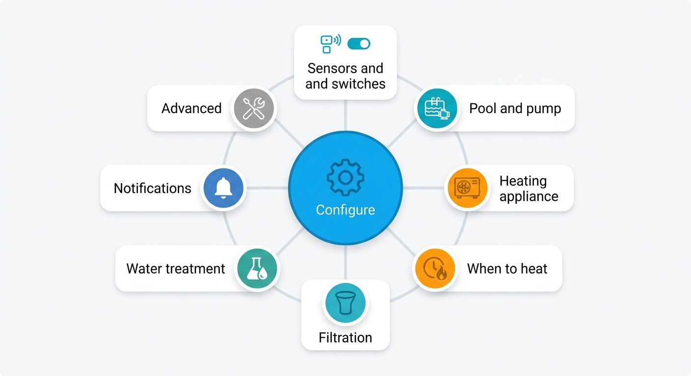

> [Home](index.md) | [Getting Started](getting_started.md) | [Architecture](architecture.md) | [Configuration](configuration.md) | [Troubleshooting](troubleshooting.md)

---

# Configuration

This document covers how to change settings after initial setup, the options
flow menu, entity reassignment, and the heat pump thermostat recommendation.
For the initial setup wizard, see the [README](index.md). For pre-filling
the wizard with your own figures, see [Defaults](defaults.md).

---

## Changing Things Afterwards

Nothing is locked in. Settings → Devices & Services → PoolSmart → **Configure**
opens a menu of subjects. All eight branch from the same hub — none depends on
another being filled in first, so there is no "right order" to work through them:

<p align="center">
  
</p>

| Section | Contains |
|---|---|
| Sensors and switches | Every switch and sensor, including the required ones. The heat pump's own sensors and the collector sensor only appear when the heating source has them |
| Pool and pump | Volume, depth, pump flow, pump power, units, sanitiser, filter medium |
| Heating appliance | The heating source and everything that follows from it: heat pump figures, the efficiency curve, the operating envelope, the solar collector. A source without a heat pump is not asked about one |
| When to heat | Target temperature, price ceiling, solar surplus, swimming time |
| Filtration | Turnover, quiet hours, pump rundown |
| Water treatment | Sanitiser, chemistry products, doses |
| Notifications | Which message goes to which device |
| Advanced | Timings and tolerances for when a measurement misbehaves |

Picking the wrong temperature sensor during setup is easy to do, so the entity could be easly replaced in the menu.

---

## Optional Entities

Every optional entity may be left blank. The matching capability is switched off
and listed in diagnostics rather than failing.

| Left blank | What stops working |
|---|---|
| Outdoor temperature | Operating envelope check; falls back to the weather entity |
| Heat pump inlet or outlet | Delta-T and COP learning |
| Flow meter | Flow protection and self-correcting block duration |
| Power sensors | Energy, cost and measured COP |
| Price sensor | Price optimisation, including the free-electricity branch |
| Solar sensors | Solar optimisation |

---

## Heat Pump Thermostat Recommendation

Set the heat pump's own thermostat to the highest temperature you would ever want
plus about two degrees. If your maximum is 32 °C, set it to 34 °C. Below that you
keep full software control over any target, and above it the hardware intervenes
if the software ever fails to switch off. The setup wizard shows this suggestion
with your own numbers filled in.

---

## House Power Limit

PoolSmart can pause heating when your total household power draw approaches a
cap you set. This protects a hard electrical limit or contract cap from being
exceeded by the combined draw of the pool equipment and the rest of the house.

### Setting it up

You need two settings, both in **Configure → Sensors and switches** or
**Configure → When to heat**:

| Setting | Where | What to enter |
|---|---|---|
| `grid_power_sensor` | Sensors and switches | Your **total household power** sensor (e.g. from a smart meter or the Home Assistant energy dashboard). This must be the whole-house reading, **not** the pool's own consumption. |
| `power_limit_w` | When to heat | The maximum total household draw in watts. |

### How the limit works

PoolSmart compares the current household draw against your limit. When the
pool pump and/or heat pump are **off**, their rated power draw is added to
the current reading first — a **look-ahead** that prevents a brief spike the
moment the equipment starts. Once running, the meter reading already includes
them, so no extra is added.

This is why you may see "heating paused" notifications even when the heat
pump is off: the combined household draw plus the pool equipment's rated
power would exceed the cap once the equipment starts.

### Choosing a realistic limit

Use this rule of thumb:

```
power_limit_w = (your electrical cap) − (comfort margin)
```

**Example:**

| | Value |
|---|---|
| Electrical cap (breaker or contract) | 5 000 W |
| Comfort margin | 500 W |
| → Set `power_limit_w` to | 4 500 W |

Then check against your actual peak usage:

1. Note your highest typical household draw (washing machine + oven + kettle
   running at once — look at your smart meter history).
2. Add the pool pump power (`pump_power_kw`) and heat pump rated input
   (`hp_input_kw`), both in watts.
3. If the sum exceeds your cap, the limiter will keep the heat pump off during
   those peaks — which is the intended behaviour.

If the notification still seems too aggressive, raise the limit. If the pool
never heats because the limit is too generous, lower it.

### Notification format

When the limit blocks heating, the notification shows the breakdown:

> Heating paused — house draw **2 500 W** + **1 000 W** for pump/heat pump =
> **3 500 W**, above the **3 000 W** limit.

- The first number is the current household draw from your `grid_power_sensor`.
- The second number is the rated power of the pool equipment that is currently
  off and would need to start.
- The third number is the projected total, compared against your configured
  limit.

### Troubleshooting

See [Troubleshooting — House Power Limit Notifications](troubleshooting.md#house-power-limit-notifications)
for common causes of unexpected pausing.

---

## See Also

- [Sensors](sensors.md) — Mapping your sensors to the right fields
- [Architecture](architecture.md) — Entity fallback table and operating envelope
- [Filtration](filtration.md) — Turnover, quiet hours, and pump rundown settings
- [Heating](heating.md) — Heating appliance configuration
