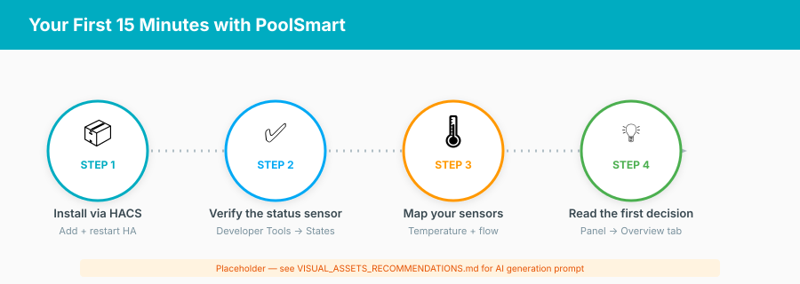
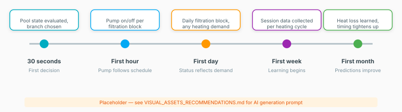

# Getting Started

Welcome to PoolSmart. This guide takes you from a fresh installation to a working,
understood system in about 15 minutes.

!!! tip "Time estimate"
    5 minutes to verify, 10 minutes to map sensors — no hardware changes needed.

  

<em>This is the pool it was built for — an Intex Metal Frame, filter pump, and a small heat pump. Yours doesn't need to look anything like it.</em>

---

## Your First 5 Minutes

  

The four steps below are the whole journey: install, verify it is alive, tell it
where your sensors are, and read its own explanation for what it just did.

After installing via HACS and completing the setup wizard, PoolSmart is already
filtering your pool. Here is how to verify everything is working:

### 1. Check the Status Sensor

Go to **Developer Tools → States** and search for `sensor.poolsmart_status`.
The state shows the current decision:

| State | Meaning |
|---|---|
| `idle` | No filtration or heating needed right now |
| `filtration` | Running the filter pump on a schedule |
| `heating` | Actively heating the pool |
| `circulating` | Running for frost protection, chemistry, or pump rundown |
| `emergency_stop` | Manual kill-switch or safety interlock active |

### 2. Open the Management Panel

Navigate to `/poolsmart` in your Home Assistant instance (add it to your sidebar
if you haven't already). This is a separate interface from any dashboard you may
add later: the sidebar panel is for *understanding* what PoolSmart is doing, not
for everyday use. The **Overview** tab shows:

- Current pool temperature
- Active mode and reason for the last decision
- Next scheduled action

  

### 3. Verify the First Decision

On the panel's **Overview** tab, read the "Last decision" reason. It explains *why*
PoolSmart made its current choice — not just what it is doing, but the condition
that made this branch win over every other one it considered. For example:

> "Filtration block: 2 hours remaining to meet today of 3 turnovers"

That sentence is the whole point of the rewrite this integration replaced: a
decision with its reasoning attached, instead of a pump that just turns on and
leaves you to guess why. If the reason mentions a sensor is "unavailable", you
likely have a mapping issue. See [Sensors](#mapping-your-sensors) below.

---

## Mapping Your Sensors

PoolSmart needs at least two readings to function:

1. **Water temperature** — from your ESPHome probe or any temperature sensor
2. **Flow meter** — from your ESPHome pulse counter (optional for basic filtration)

  

<em>Everything in this photo maps to one row in the table below. The full hardware build is in <a href="hardware.md">Hardware</a>.</em>

Every other row in the table below is optional, and PoolSmart tells you exactly
what it loses without it rather than failing silently. If you installed the
ESPHome board from [ESPHome](esphome.md), the sensors
are auto-discovered. Otherwise, map them manually:

**Settings → Devices & Services → PoolSmart → Configure → Sensors and switches**

| Sensor | Required | Purpose |
|---|---|---|
| Water temperature | Yes | Determines heating demand and filtration timing |
| Flow meter | No | Measures actual flow for smart filtration |
| Air temperature | No | Enables COP-based heating optimization |
| Solar collector temperature | No | Enables solar surplus detection |
| Electricity price sensor | No | Enables price-aware scheduling |

!!! tip "Graceful degradation"
    Leave any sensor you don't have blank. PoolSmart disables the matching feature gracefully and reports it in Diagnostics — nothing breaks.

---

## What to Expect on Day One

Nothing about PoolSmart needs a waiting period to start working, but two things
— the self-learning model and heating predictions — only get *better* with time.
Here is the honest timeline, so "it's not perfect yet" on day one doesn't read
as broken:

  

| Timeframe | What Happens |
|---|---|
| **First 30 seconds** | PoolSmart evaluates the pool state and makes its first decision |
| **First hour** | You'll see the pump turn on/off according to the filtration schedule |
| **First day** | The status sensor reflects daily filtration blocks and any heating demand |
| **First week** | The self-learning model begins collecting session data |
| **First month** | Heating predictions improve as the model learns your pool's heat loss |

---

## Next Steps

Now that PoolSmart is running, you may want to:

- [Configure heating](planning.md) — Set target temperature and price ceiling
- [Understand the decision ladder](architecture.md) — Why PoolSmart makes the choices it does
- [Install a dashboard](lovelace/README.md) — Visual overview for household members
- [Set up notifications](logging.md) — Get alerted about important events

---

## Common First-Day Questions

**Q: The pump isn't running. Is something wrong?**

Check the status sensor. If it shows `idle`, PoolSmart has determined no filtration
is needed right now. This is normal outside scheduled blocks. To force filtration,
use the manual override switch in Home Assistant.

**Q: How do I know it's filtering enough?**

The panel's **Overview** tab shows today's progress toward the turnover target.
For a typical pool, 1-3 turnovers per day is sufficient.

**Q: Can I change settings without breaking anything?**

Yes. All settings are in the options flow and can be changed at any time. Nothing
is locked in. See [Configuration](configuration.md).

---

## See Also

- [Configuration](configuration.md) — Full configuration reference
- [Architecture](architecture.md) — How the priority decision ladder works
- [Panel](panel.md) — Management panel reference
- [Troubleshooting](troubleshooting.md) — When something goes wrong
