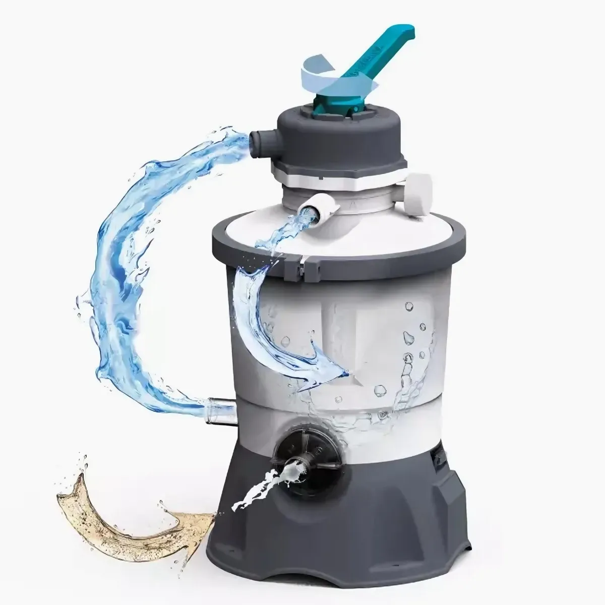
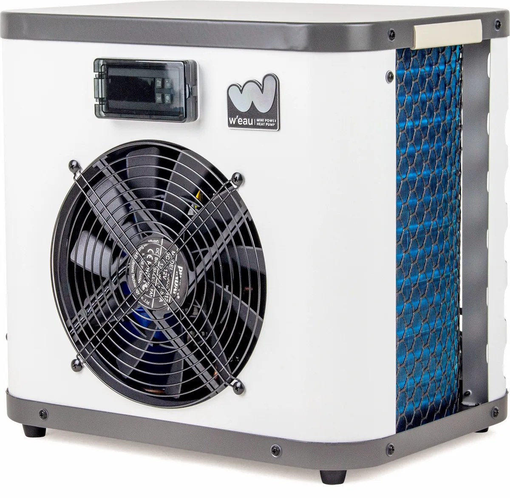
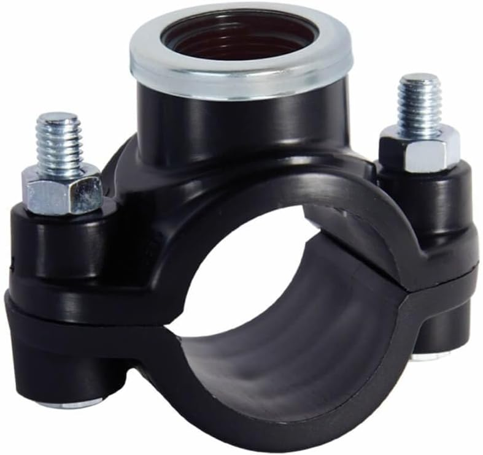
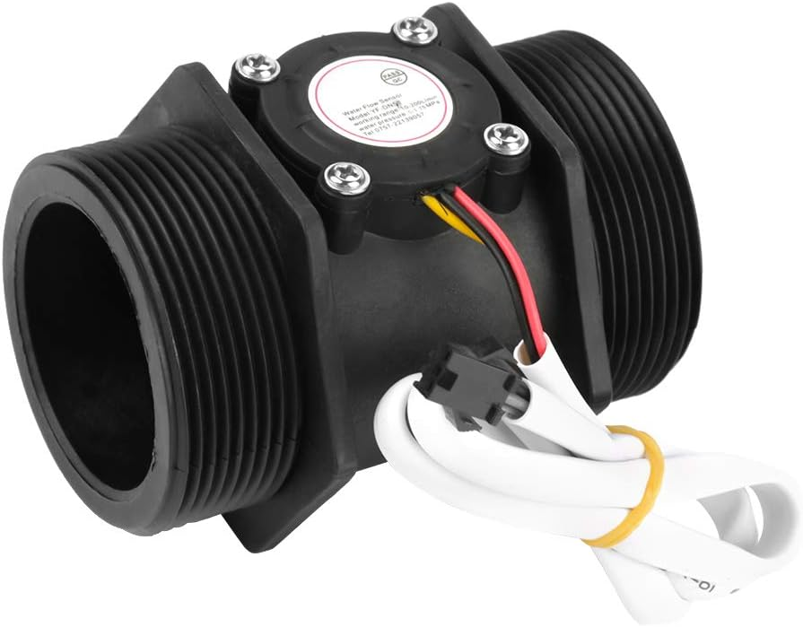
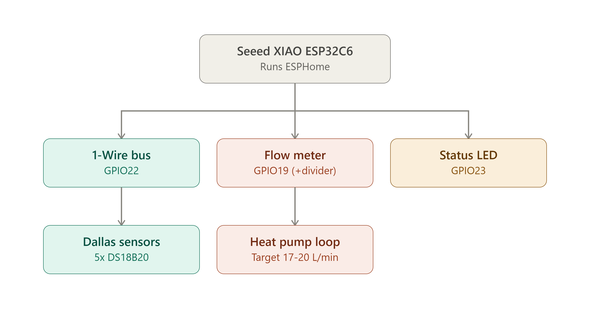

[← Back to README](../README.md) • [Architecture](architecture.md) • [Planning](planning.md) • [Learning](learning.md) • **Hardware** • [ESPHome](esphome.md) • [Sensors](SENSORS.md) • [Defaults](DEFAULTS.md)

---

# Hardware & Wiring Guide

This document covers the physical installation: component selection, pinouts,
voltage step-down circuits, and pipe mounting. For the ESPHome YAML
configuration and sensor calibration, see [esphome.md](esphome.md). For mapping
sensors to integration fields, see [SENSORS.md](SENSORS.md).

---

## Bill of Materials

| Component | Function / Application | Notes |
| :--- | :--- | :--- |
| **Seeed XIAO ESP32-C6** | Main microcontroller running ESPHome. | Compact, native Wi-Fi 6 / Bluetooth. |
| **5× DS18B20 probes** | Temperature sensors for pool, pump, heat pump, and outdoor. | Waterproof stainless-steel Dallas 1-Wire probes. |
| **DN50 pulse flow sensor** | Measures volume flow rate through the heat pump loop. | Yanmis DN50 Hall-effect pulse sensor. |
| **4.7 kΩ resistor** | Pull-up resistor for the 1-Wire bus. | Connects between 3.3 V and GPIO22. |
| **10 kΩ + 20 kΩ resistors** | Voltage divider for the flow meter signal. | Steps 5 V pulses down to 3.3 V for GPIO19. |
| **Waterproof enclosure** | IP65+ junction box near the pool pump setup. | Protects ESP32 board and wiring. |
| **Bestway Flowclear** | Circulation filter pump. | Measured at ~3.6 m³/h. |
| **W'eau Mini Power (3 kW)** | Heat pump for water heating. | ~0.58 kW electric input. |
| **Intex Metal Frame** | Pool structure (3,834 L at 66 cm water level). | 300 × 200 × 75 cm. |

---

## Pinout & Wiring Diagram

All five Dallas probes share a single 1-Wire bus on **GPIO22** and are identified
by their unique hardware addresses in software.

| Device / Signal | ESP32-C6 Pin | Circuit Requirements |
| :--- | :---: | :--- |
| **1-Wire bus** (5× DS18B20) | `GPIO22` | Requires a 4.7 kΩ pull-up resistor to 3.3 V. |
| **Flow meter signal** | `GPIO19` | **Must use voltage divider** (5 V → 3.3 V). |
| **Status LED** | `GPIO23` | Direct connection (inverted logic). |

### 5 V Hall-Effect Flow Meter Voltage Divider

> **Critical:** Hall-effect flow meters produce **5 V logic pulses**. Connecting
> 5 V directly to an ESP32 GPIO pin will permanently destroy the pin. Use a
> voltage divider:

```text
Meter Signal (5 V pulse)
          │
       [10 kΩ]
          │──────────────► GPIO19 (ESP32)
          │
       [20 kΩ]
          │
         GND
```

The 10 kΩ / 20 kΩ divider reduces the 5 V pulse to approximately **3.3 V**,
making it safe for the ESP32.

---

## Physical Installation & Mounting

| Component | Image | Mounting Details |
| :--- | :---: | :--- |
| **Filter pump** |  | Installed in the main circulation loop. |
| **Heat pump** |  | Installed downstream of the filter pump. |
| **Temperature sensors** |  | DS18B20 probes attached to the PVC pipe using thermal paste and pipe clamps for accurate surface readings. |
| **Flow meter** |  | DN50 Hall-effect flow meter installed in the return line from the heat pump. |

---

## Wiring Overview

<p align="center">
  
</p>

---

## See Also

- [esphome.md](esphome.md) — ESPHome YAML configuration that matches this wiring.
- [SENSORS.md](SENSORS.md) — How to calibrate the probes and flow meter after
  installation.
- [esphome/pool_sensors.yaml](../esphome/pool_sensors.yaml) — Complete example
  ESPHome configuration with pin assignments and calibration offsets.
