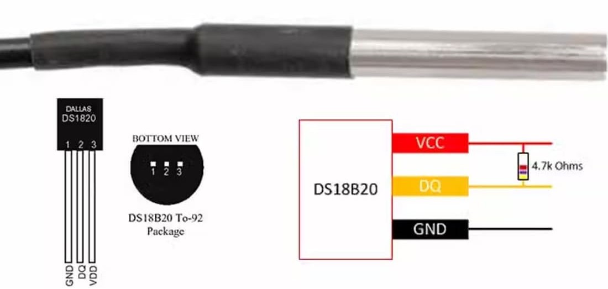

# Hardware
 
This page covers the physical build: what's in it, how it's wired, and what
it actually looks like. For the ESPHome software side (sensors, entities,
calibration steps), see [`docs/esphome.md`](esphome.md).
 
## Parts list
 
| Part | Used for |
|---|---|
| Seeed XIAO ESP32C6 | Main controller running ESPHome |
| 5x DS18B20 (Dallas) temperature sensor | Pool water, pump in/out, heat pump in/out, outdoor |
| Pulse-based flow meter (DN50) | Flow rate through the heat pump loop |
| 4.7 kΩ resistor | Pull-up for the 1-Wire (Dallas) bus |
| Voltage divider (e.g. 10 kΩ + 20 kΩ) | Steps the flow meter's 5V pulse down to 3.3V for the GPIO |
| Waterproof enclosure | Houses the ESP32 and wiring near the pool |
| Bestway Flowclear filter pump | Circulation |
| W'eau Mini heat pump | Heating |
| Intex Metal Frame pool (3,834 L) | The pool itself |
 
## Wiring
 
| Signal | GPIO |
|---|---|
| 1-Wire bus (all Dallas sensors) | GPIO22 |
| Flow meter pulse input | GPIO19 |
| Status LED | GPIO23 |
 
All five Dallas sensors share the same 1-Wire bus on GPIO22 — they're
distinguished in software by their unique hardware address (see
[`docs/esphome.md`](esphome.md) for the address list and how to find yours
with a Dallas scan).
 
The flow meter outputs 5V pulses, so it needs a voltage divider (or a
5V-tolerant pin) before it reaches the ESP32's GPIO — feeding 5V directly
into a 3.3V-only pin will damage it.
 
> 🔌 *A wiring diagram will go here.*
 
## Photos
 
| | |
|---|---|
|  | Bestway Flowclear filter pump |
|  | W'eau Mini Power 3kW heat pump |
|  | DS18B20 temperature sensor |
|  | Pulse-based flow meter |
|  | Pipe clamp used to mount a sensor against the pipe |
 
### Wiring overview
 

 
The controller's 1-Wire bus (GPIO22) feeds all five Dallas sensors, the
flow meter sits on GPIO19 behind a voltage divider, and the status LED is
on GPIO23.
 
> 📸 *Add your own installation photos here too — the enclosure in place,
> the sensors clamped onto the pipework, and the overall setup next to the
> pool.*
 
## Calibration
 
The flow meter needs a one-time calibration after installing (collecting a
known volume and counting pulses), and each temperature sensor can be
fine-tuned with a small offset from Home Assistant. Both are covered step by
step in [`docs/esphome.md`](esphome.md).
