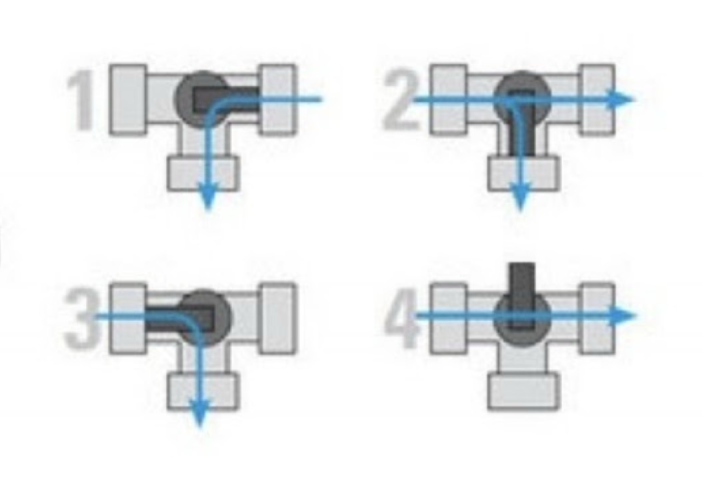

> [Home](index.md) | [Getting Started](getting_started.md) | [Architecture](architecture.md) | [Configuration](configuration.md) | [Troubleshooting](troubleshooting.md)

---

# Heating

This document covers the heating sources PoolSmart supports, how solar
collectors are handled, and how pool construction affects heat loss. For the
heating planner that schedules sessions, see [Planning](planning.md). For
the self-learning model that improves heating predictions, see
[Learning](learning.md).

---

## Heating Sources

Setup asks three things before anything else: how the pool is built, what heats
it, and whether there is a solar collector alongside. Those answers decide which
of the later questions make sense at all.

  

A heat pump is the source everything else in this document is written against —
the efficiency curve, the operating envelope, and the compressor protection all
exist because a heat pump has weather-dependent limits the other sources don't.

| Source | What it has |
|---|---|
| Heat pump | Efficiency curve, minimum air temperature, compressor protection |
| Electric heater | None of those — always as efficient, works in any weather |
| Solar collector | Usually a manual valve, so the integration advises rather than switches |
| Gas heater | Fixed efficiency, no air temperature limit |
| No heating | Filtration, water chemistry and frost protection only |

  

These are not simplifications of a heat pump's behaviour; they are the absence
of things a heat pump has. Asking an element owner for a COP curve produces a
field they have to guess at, and a guess is worse than a default.

---

## Solar Collectors

A solar collector is advised, not controlled. Almost every one is plumbed
through a manual three-way valve: one position sends the return flow through the
collector loop, the other bypasses it straight back to the pool. Nothing in
PoolSmart operates that valve — it only tells you which position is currently
worth having.

  
  

<em>The valve itself, and how it routes flow between the pool and the collector loop.</em>

The integration compares the collector against
the pool and says when opening it is free heat — and, just as usefully, when the
collector is colder than the pool and water sent through it would lose heat
rather than gain it.

Above a threshold of surplus solar power, heating is treated as free and the
price limit is ignored. The threshold is not a fixed number, because the right
value is a property of the installation: it has to be at least what the heat pump
and circulation pump draw together. For a 3 kW heat pump taking 580 W with a
100 W pump that is 680 W, plus a margin so a passing cloud does not start and
stop a session.

Leave the setting empty and it is calculated. Set it too low and you consume more
than you generate; set it too high and you decline free heat on moderately sunny
afternoons.

`sensor.<name>_solar_surplus` shows the current figure with the threshold, the
shortfall and the equipment draw as attributes, so "is this enough" has a visible
answer.

---

## Pool Construction

Pool construction sets a starting heat loss, from 0.30 °C/h for an uninsulated
inflatable to 0.08 for a built-in pool. It is only a starting point, replaced by
measurement within days, but those first days are when someone is deciding
whether this works at all.

  

---

## See Also

- [Planning](planning.md) — How heating sessions are planned and optimized
- [Learning](learning.md) — How heat loss and heating rate are learned from sessions
- [Architecture](architecture.md) — The heat pump operating envelope and compressor protection
- [Configuration](configuration.md) — How to change heating settings after setup
