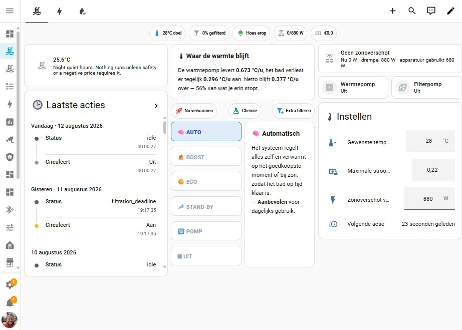

  

  <em>Intelligent swimming pool controller for Home Assistant — ESPHome measures, HA decides.</em>

  
  
  
  

---

PoolSmart turns your pool into a self-optimizing system. Automate filtration scheduling,
heat pump control, solar optimization, and water chemistry dosing — all integrated with
Home Assistant. A priority-based decision engine evaluates your pool state every 30 seconds,
balancing energy costs, swim schedules, and equipment protection.

> 🤖 **_Disclaimer: Co-written with AI. If your pool turns into a foam party, blame the LLM (or check your pH)._**

  

---

## Features

| | | |
|---|---|---|
| **Smart filtration** — runtime from pool volume and measured flow | **Heat pump control** — plans around dynamic prices and solar surplus | **Self-learning** — learns heat loss, heating rate, and COP, with manual session review |
| **Water chemistry** — pH readings become dosing instructions | **Solar optimization** — heats with free surplus | **Price-aware scheduling** — works backwards from swim time |
| **Compressor protection** — minimum off/run times enforced | **AI advisory** — suggests settings, applies nothing without approval | **Dashboards** — detailed three-tab view and simple household page |

---

## Installation

### Method 1: Easy (One-Click)

1. Click the button below to add PoolSmart to HACS automatically:

   

2. Click **Download** in HACS and restart Home Assistant.
3. Click the button below to configure PoolSmart:

   

---

### Method 2: Manual

1. Open **HACS** in your Home Assistant instance.
2. Click **Custom Repositories** (top right) and add `rickertie/Poolsmart` with category **Integration**.
3. Download PoolSmart and restart Home Assistant.
4. Go to **Settings → Devices & Services → Add Integration → PoolSmart**.

!!! note "Full setup"
    **Full setup** (unlock all features):
    - Map your temperature sensors and flow meter
    - Configure heating source and target temperature
    - Connect a price sensor for cost optimization
    - See [Hardware](hardware.md) and [ESPHome](esphome.md)

---

  

## Documentation

### Getting Started

Start here: [Getting Started Guide](getting_started.md) — first-time setup, verifying your installation.

### Core Concepts

| Topic | Document | Covers |
|---|---|---|
| Architecture & decision core | [Architecture](architecture.md) | Priority ladder, filtration math, AI layer |
| Heating planning & prices | [Planning](planning.md) | Maintenance vs. seasonal mode, price integrations |
| Self-learning model | [Learning](learning.md) | Learned parameters, validation rules, session logging |

### Subsystems

| Topic | Document | Covers |
|---|---|---|
| Filtration | [Filtration](filtration.md) | Turnover, daily minimum, filter media, delta-T |
| Heating sources | [Heating](heating.md) | Heat pump, electric, solar, gas |
| Water chemistry | [Chemistry](chemistry.md) | Dosing, test intervals, circulation timing |

### Setup & Configuration

| Topic | Document | Covers |
|---|---|---|
| Hardware & wiring | [Hardware](hardware.md) | Bill of materials, pinouts, voltage divider |
| ESPHome setup | [ESPHome](esphome.md) | Board configuration, probe calibration |
| Sensor mapping | [Sensors](sensors.md) | Sensor placement, calibration procedures |
| Configuration | [Configuration](configuration.md) | Options flow, entity reassignment |
| Pre-filling the wizard | [Defaults](defaults.md) | Starting the wizard with your own figures |

### Reference

| Topic | Document | Covers |
|---|---|---|
| Entity IDs | [Entities](entities.md) | Fixed IDs, translated names, source sensors |
| Management panel | [Panel](panel.md) | Six-tab sidebar panel at `/poolsmart` |
| Dashboards | [Lovelace dashboards](lovelace/README.md) | Installing and customizing Lovelace dashboards |
| Logging & diagnostics | [Logging](logging.md) | Logbook entries, notifications, full trace |
| Troubleshooting | [Troubleshooting](troubleshooting.md) | Common issues, fault isolation, diagnostics |
| Development | [Development](development.md) | Running tests, contributing |
| Brand images | [Brand images](brand-image.md) | Integration icon and logo, HACS workaround |
| Community post | [Community post](community_post.md) | Community launch announcement |
| Changelog | [CHANGELOG.md](https://github.com/rickertie/Poolsmart/blob/main/CHANGELOG.md) | Release history |

---

## The Management Panel

PoolSmart ships a full management panel at `/poolsmart` with six tabs: Overview,
Planning, Sessions, Learning, Diagnostics, and Settings. It visualizes the decision
ladder, lets you review past heating and filtration sessions, and exposes the
self-learning engine — see [Panel](panel.md) for the complete reference.

For everyday use by household members, a simple [Lovelace dashboard](lovelace/README.md)
is also provided.

---

## Quick Links

!!! tip
    - 🚀 **First time?** Check out the [Getting Started Guide](getting_started.md)
    - 📈 **COP & Heat loss:** Read about the [Self-Learning Engine](learning.md)
    - 💡 **Dynamic Prices:** Learn how [Price-Aware Heating](planning.md) works
    - 🧪 **Water Quality:** Review [Automated Dosing Math](chemistry.md)
    - 📊 **UI Layout:** Set up your [Lovelace Dashboards](lovelace/README.md)

---

## License

AGPL-3.0-or-later
