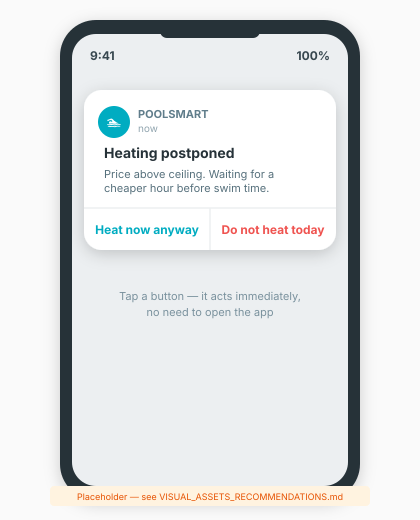

> [Home](index.md) | [Getting Started](getting_started.md) | [Architecture](architecture.md) | [Configuration](configuration.md) | [Troubleshooting](troubleshooting.md)

---

# Logging & Diagnostics

This document covers the three kinds of log entries PoolSmart produces, the
notification system with action buttons, the full ladder trace, and how to
export diagnostics for troubleshooting. For the management panel that displays
diagnostics, see [Panel](panel.md).

---

## Logbook Entries

Three kinds of entry appear in the standard Home Assistant **Logbook**, alongside
everything else that happened in the house. That context is most of the value: a
pump switching off at 20:00 means one thing alone and another next to "the shed
door opened at 19:58".

### Decisions

What changed, the reason recorded at the moment of deciding, and how long the
previous state lasted. A branch change is logged even when the switches do not
move — the pump staying on for a different reason is still a change of reasoning,
and it used to be invisible.

### Obstacles

What the ladder wanted to do but could not: the price was too high, the mode
excludes it, the heat pump is outside its limits, the night window blocks it.
This is the answer to "why is it not heating", and it is rate limited so a pool
waiting all evening for a cheaper price does not fill the logbook with the same
sentence.

### Faults

Raised and cleared, so the duration is visible rather than inferred from
timestamps.

---

## Restore Summary

One line, logged at **INFO** level — visible with no debug logging enabled —
the moment PoolSmart finishes reading its stored state back on every start or
reload:

```
PoolSmart state restored: quota_date=2026-08-24, filtration credited=1.75h
from 3 interval(s), last write to disk was 2026-08-24T20:15:00+00:00
```

This answers the question a "lost today's filtration credit after a
restart" report always starts with — what did this boot actually find on
disk — without needing debug logging turned on first or a search through the
full log. The same figures, plus whether the pump had an interval still open
when the last save happened, are also in the diagnostics file's
`persistence` section (see [Sharing a Problem](#sharing-a-problem) below).

---

## Notifications You Can Answer

Notifications to a mobile app carry buttons. "Heating postponed" offers *Heat now
anyway* and *Do not heat today*; a flow fault offers *Circulate only* and *Switch
everything off*; the weekly review offers *Apply the suggestion*. Tapping one
acts immediately. Other notify platforms ignore the extra data and receive the
text as normal.

<p align="center">
  
</p>

On iOS, the Companion app sometimes shows action buttons only after a
long-press or swipe on the notification, rather than directly under it --
that is standard iOS behaviour for actionable notifications, not a PoolSmart
bug. If buttons do not appear at all, check that Companion app's
notification permissions are enabled and that critical-alert settings are
not suppressing them.

---

## The Full Trace

The panel's Diagnostics tab shows every branch of the ladder for the current
tick, with a verdict for each: chosen, price, outside limits, mode, night, not
applicable, or not reached. The ladder stops at the first match, so branches
below the winner genuinely were not evaluated — saying "not reached" is a fact
about how it works, not an omission.

<p align="center">
  
</p>

---

## Sharing a Problem

Settings → Devices & services → PoolSmart → the three dots → **Download
diagnostics**. That file has the trace, the decision log, a plain-sentence
timeline, learned values, faults, every derived figure, and a `persistence`
section (quota date, filtration hours credited, last write to disk — see
[Restore Summary](#restore-summary) above), with no credentials in it. It is
the fastest way to hand someone the whole picture.

---

## See Also

- [Panel](panel.md) — The management panel's Diagnostics tab
- [Architecture](architecture.md) — The decision ladder and branch evaluation
- [Troubleshooting](troubleshooting.md) — What to check when something goes wrong
