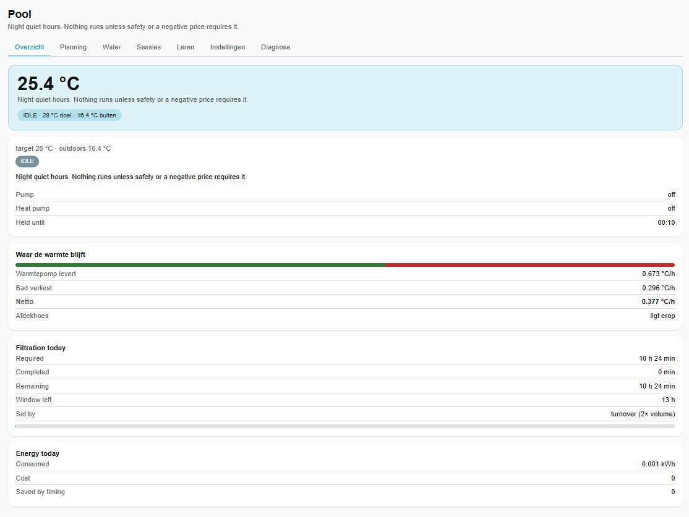
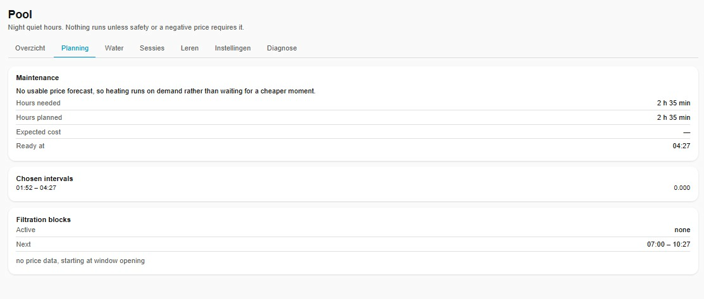
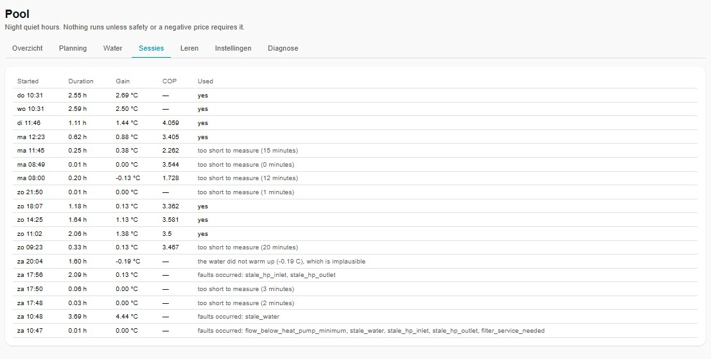
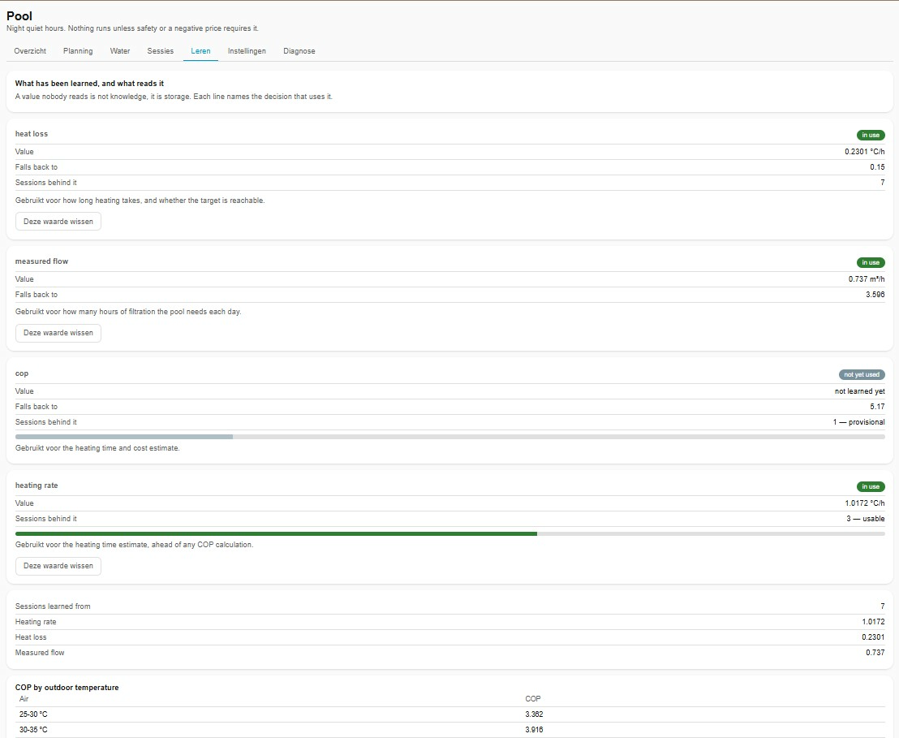
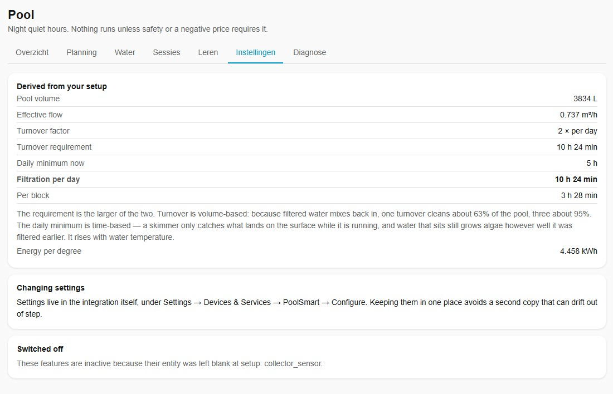
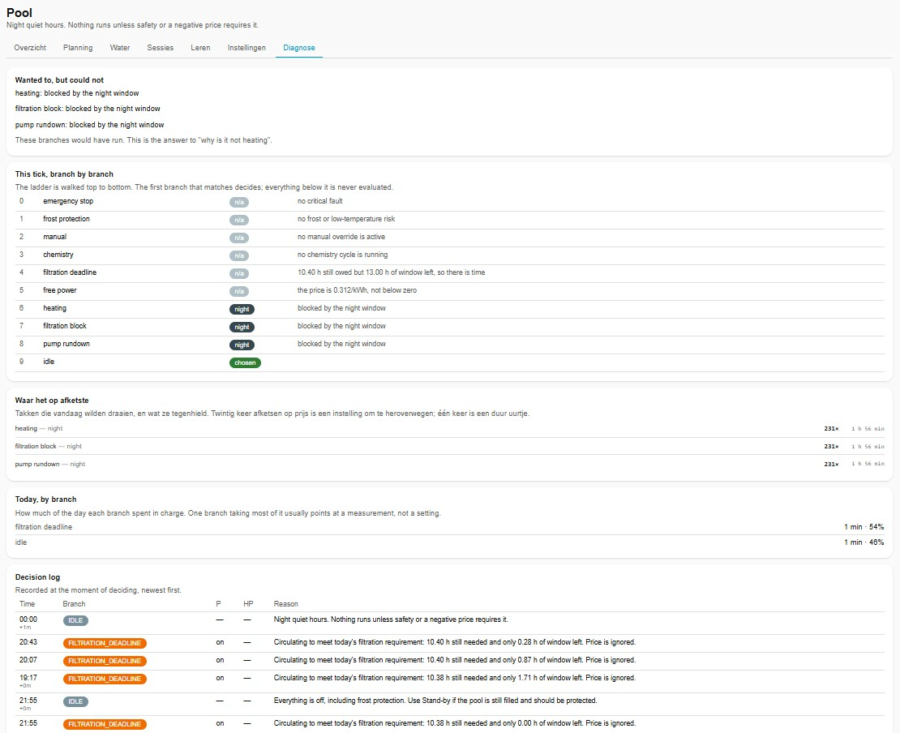

> [Home](index.md) | [Getting Started](getting_started.md) | [Architecture](architecture.md) | [Configuration](configuration.md) | [Troubleshooting](troubleshooting.md)

---

# Management Panel

This document covers the PoolSmart sidebar panel at `/poolsmart`. For the
Lovelace dashboards (a separate interface for household members), see
[lovelace/README.md](lovelace/README.md).

---

## What It Is

A sidebar panel at `/poolsmart` with six tabs: overview, planning, sessions,
learning, settings, and diagnostics. It is written as a plain custom element with
no build step and no external imports, so it keeps working without internet.

The panel is for whoever maintains the system. The Lovelace page in
`docs/lovelace/` is for everyone else, and the two are deliberately not the same
thing.

---

## Tabs Overview

| Tab | What you will find |
|---|---|
| Overview | Current status, mode, temperature, and the reason for the last decision |
| Planning | Heating plan, price forecast, and target time/date |
| Sessions | Session history with learned values, rejection reasons, and manual review controls |
| Learning | Learned heat loss, heating rate, and COP curve with confidence bars; monthly trend and COP-by-temperature charts; storage stats, maintenance actions, and export/import |
| Settings | Quick access to common settings without opening the full options flow |
| Diagnostics | Full ladder trace, decision log, faults, and export button |

---

## Tab Details & Screenshots

### 1. Overview Tab
Provides a real-time summary of the pool state, active operating mode, live temperatures, and the primary reason behind the decision engine's last action.

  

---

### 2. Planning Tab
Displays the automated heating schedule, real-time dynamic energy price forecasts, and target temperatures for scheduled swim sessions.

  

---

### 3. Sessions Tab
Logs past heating and filtration cycles, displaying evaluated metrics, learned parameter updates, and reasons for any rejected runs. Each session carries Auto/Include/Exclude review controls, with a "worth a look" flag on sessions the automatic verdict is likely to have gotten wrong. See [Learning](learning.md#reviewing-a-session).

  

---

### 4. Learning Tab
Visualizes the self-learning engine's performance models, including heat loss calculations, heating rate estimations, and the active COP curve with confidence margins. Monthly heating rate, heat loss, and COP each get a line chart covering the last 12 months, and COP by outdoor temperature gets a bar chart, alongside the underlying tables. Below that sits storage statistics, maintenance actions (reprocess history, clear debug traces, clear all history), and export/import, including a selective export and an advanced full-replace option. See [Learning](learning.md#maintenance-exportimport).

  

---

### 5. Settings Tab
Offers quick access to frequently adjusted operational targets and overrides without needing to open the main Home Assistant integration configuration wizard.

  

---

### 6. Diagnostics Tab
Exposes full decision ladder traces, detailed event logs, system fault notifications, and an export button for diagnostic data.

  

---

## See Also

- [lovelace/README.md](lovelace/README.md) — Lovelace dashboards for household members
- [Logging](logging.md) — Logbook entries and the full trace
- [Troubleshooting](troubleshooting.md) — What to check when something goes wrong
- [Architecture](architecture.md) — The decision ladder and branch evaluation